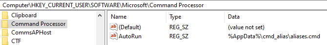

# cmd_alias
Simple alias implementation (?) for windows using doskey

## Usage
List available alias
```bash
alias
```
Set an alias
```bash
alias set key=value
```
Remove an alias
```bash
alias del key
```
Reload alias
```bash
alias load
```

## Build
Not much to say, just build it, I guess.
```sh
git clone einjerjar/cmd_alias
cd cmd_alias
cargo build --release
```

## Installation
* After building, expose the release file (`/target/release/alias.exe`) to path (either copy it to an existing exposed folder or add the build folder to path (not a good idea)).
* Run the `setup.reg` file included within the project at least once to apply the `aliases.cmd` on every instance of cmd.

> 

* Run the file at least once to generate the alias file (there will likely be an error on the first run, you can ignore it).
* Profit.

### Installation without Administrator rights
* Figure out a way to add the alias file to the cmd/ startup (mb, too lazy to see if possible).
* Profit.

## Suggested Alias
Some suggested alias to for a more authentic feel (lol) (**add them in the same order to prevent issues, or just use alias.exe directly!**)

```sh
alias set alias=alias.exe set $*
alias unalias=alias.exe del $*
```

This way you can use `alias` and `unalias` in a similar to most unix oses.

Also, due to the way it is implemented, `alias set` and `alias del` actually runs `alias list` when there is no extra argument, thus allowing for `alias` and `unalias` to list the available aliases instead or error out, eyy :D.

As a bonus you can still use alias.exe incase you messed up.

### Extra stuff
Actual list of all available commands
```
alias [list] [set/add] [del/remove] [load/silent/source/s]
```

### Wanna support me stuff? :3
<a href='https://ko-fi.com/X8X831J1L' target='_blank'></a>